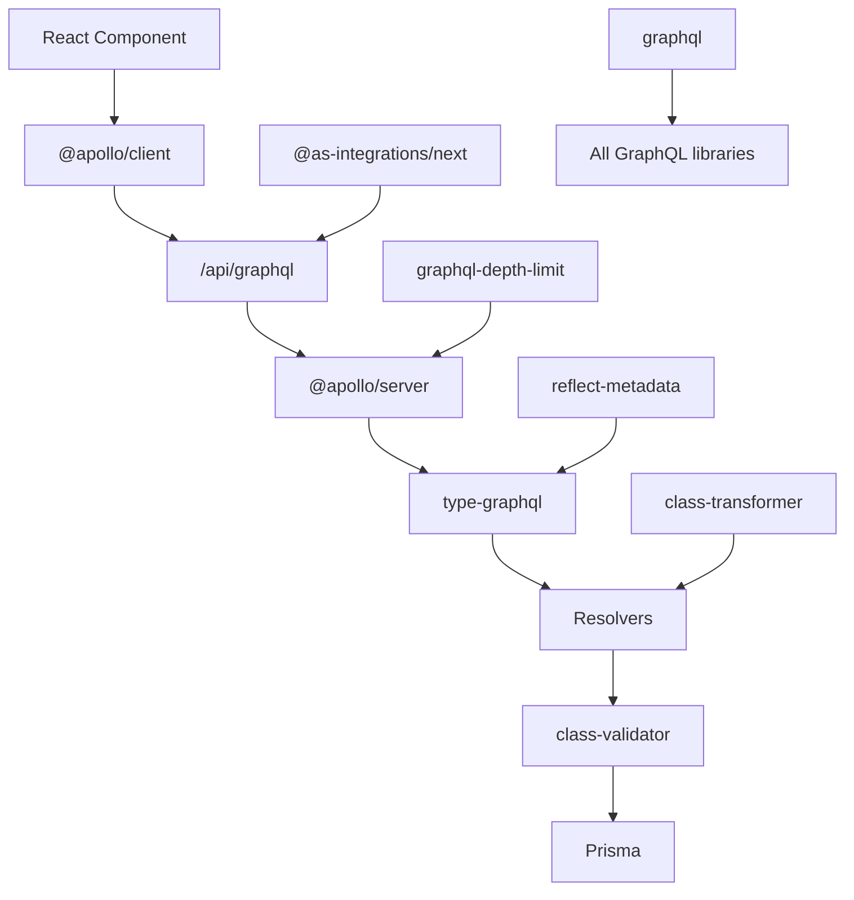

# GraphQLライブラリガイド - Setlist Studio

このガイドでは、Setlist Studioで使用しているGraphQLライブラリの詳細について解説します。

## 📚 関連ドキュメント

- **[GraphQLアーキテクチャ](../../claude/api/GRAPHQL_ARCHITECTURE.md)** - アーキテクチャの全体像
- **[GraphQL初心者ガイド](./GRAPHQL_BEGINNER_GUIDE.md)** - GraphQL入門とレストラン比喩

## 🎯 なぜこれらのライブラリが必要なのか？

GraphQLエコシステムは複雑で、各ライブラリが特定の問題を解決しています。Setlist Studioでは以下のライブラリを使用し、それぞれが重要な役割を果たしています。

## 📋 使用ライブラリ一覧

| カテゴリ | ライブラリ | バージョン | 主な役割 | レストラン例 |
|---------|------------|-----------|----------|-------------|
| **🔧 コア** | `graphql` | 15.8.0 | GraphQL仕様の実装 | 基本的な調理器具 |
| **🔧 コア** | `type-graphql` | 1.1.1 | TypeScriptベースのスキーマ構築 | 魔法の料理本 |
| **🖥️ サーバー** | `@apollo/server` | 4.12.2 | GraphQLサーバー実装 | プロ仕様の厨房設備 |
| **🖥️ サーバー** | `@as-integrations/next` | 3.2.0 | Next.js統合 | 厨房とフロアの配膳システム |
| **🖥️ サーバー** | `graphql-depth-limit` | 1.1.0 | セキュリティ強化 | 無茶な注文を制限する店のルール |
| **🎨 クライアント** | `@apollo/client` | 3.13.8 | フロントエンドGraphQLクライアント | 優秀なウェイター |
| **🔒 セキュリティ** | `class-validator` | 0.14.2 | 入力検証 | 品質管理係 |
| **🔒 セキュリティ** | `class-transformer` | 0.5.1 | データ変換 | 盛り付け係 |
| **🛠️ ユーティリティ** | `reflect-metadata` | 0.2.2 | メタデータ管理 | 情報係 |

## 🔄 ライブラリの協調関係



## 🎯 カテゴリ別の役割

### 🔧 **コアライブラリ** - 基盤技術
GraphQL仕様の実装とTypeScriptとの統合

### 🖥️ **サーバーサイド** - バックエンド処理
GraphQLサーバーの実装、Next.js統合、セキュリティ

### 🎨 **クライアントサイド** - フロントエンド処理
React上でのGraphQL通信とキャッシュ管理

### 🔒 **セキュリティ** - データ保護
入力検証、データ変換、型安全性

### 🛠️ **ユーティリティ** - 補助機能
メタデータ管理、デコレーターサポート

---

## 🔧 コアGraphQLライブラリ

### 1. **graphql@15.8.0** - GraphQLの中核

```json
"graphql": "^15.8.0"
```

**役割**: GraphQL仕様そのものの実装

**必要性**: 
- GraphQLクエリのパース（解析）
- スキーマの定義と検証
- 実行エンジンの提供
- 全てのGraphQLライブラリの基盤

**レストラン例**: 「料理を作るための基本的な調理器具」

### 2. **type-graphql@1.1.1** - TypeScriptベースのスキーマ構築

```json
"type-graphql": "1.1.1"
```

**役割**: デコレーターベースのGraphQLスキーマ生成

**必要性**:
- TypeScriptの型とGraphQLスキーマの自動同期
- コード重複の排除
- 型安全性の保証
- 保守性の向上

**レストラン例**: 「レシピを自動的に作成する魔法の料理本」

```typescript
// Type-GraphQLなし（従来の方法）
const typeDefs = gql`
  type User {
    id: ID!
    email: String!
    username: String!
  }
  
  type Query {
    users: [User!]!
  }
`

// Type-GraphQLあり（現在の方法）
@ObjectType()
export class User {
  @Field(() => ID)
  id: string;
  
  @Field()
  email: string;
  
  @Field()
  username: string;
}

@Resolver()
export class UserResolver {
  @Query(() => [User])
  async users(): Promise<User[]> {
    return prisma.user.findMany();
  }
}
```

---

## 🖥️ サーバーサイドライブラリ

### 3. **@apollo/server@4.12.2** - GraphQLサーバー実装

```json
"@apollo/server": "^4.12.2"
```

**役割**: 本格的なGraphQLサーバーの提供

**必要性**:
- GraphQLクエリ実行エンジン
- セキュリティ機能（クエリ深度制限、イントロスペクション制御）
- パフォーマンス最適化
- プラグインシステム

**レストラン例**: 「プロ仕様の厨房設備」

```typescript
// Apollo Serverの高度な設定
const server = new ApolloServer({
  schema: graphqlSchema,
  introspection: process.env.NODE_ENV !== 'production',
  validationRules: [depthLimit(10)], // DoS攻撃防止
  formatError: (err) => {
    // セキュリティ強化エラーハンドリング
    if (process.env.NODE_ENV === 'production') {
      return { message: 'サーバーエラーが発生しました' };
    }
    return err;
  },
  plugins: [
    // パフォーマンス監視、キャッシュ等
  ]
});
```

### 4. **@as-integrations/next@3.2.0** - Next.js統合

```json
"@as-integrations/next": "^3.2.0"
```

**役割**: Apollo ServerとNext.js API Routesの橋渡し

**必要性**:
- Vercel Functionsとの互換性
- Next.jsのリクエスト/レスポンス処理
- 統一されたアーキテクチャ

**レストラン例**: 「厨房とフロアを繋ぐ効率的な配膳システム」

```typescript
// Next.js API Routeとの統合
const handler = startServerAndCreateNextHandler(server, {
  context: async (req) => createSecureContext(req),
});

export async function POST(request: NextRequest) {
  return handler(request);
}
```

### 5. **graphql-depth-limit@1.1.0** - セキュリティ強化

```json
"graphql-depth-limit": "^1.1.0"
```

**役割**: GraphQLクエリの深度制限

**必要性**:
- DoS攻撃防止
- 悪意のある深いクエリの制限
- サーバーリソース保護

**レストラン例**: 「無茶な注文を制限する店のルール」

```typescript
// 危険なクエリの例（無制限だと危険）
query DangerousQuery {
  user {
    setlists {
      songs {
        user {
          setlists {
            songs {
              // 無限に続く...
            }
          }
        }
      }
    }
  }
}

// 深度制限で防止
validationRules: [depthLimit(10)]
```

---

## 🎨 クライアントサイドライブラリ

### 6. **@apollo/client@3.13.8** - フロントエンドGraphQLクライアント

```json
"@apollo/client": "^3.13.8"
```

**役割**: React用GraphQLクライアント

**必要性**:
- GraphQLクエリの実行
- キャッシュ管理
- 状態管理
- エラーハンドリング
- 認証ヘッダー自動付与

**レストラン例**: 「お客さんの注文を管理し、料理を配膳する優秀なウェイター」

```typescript
// 強力なキャッシュ機能
const { data, loading, error } = useQuery(GET_SETLISTS, {
  fetchPolicy: 'cache-first', // キャッシュ優先
  errorPolicy: 'all',
  onError: (error) => console.error('GraphQL Error:', error),
});

// 楽観的更新
const [createSetlist] = useMutation(CREATE_SETLIST, {
  optimisticResponse: {
    createSetlist: {
      id: 'temp-id',
      name: input.name,
      __typename: 'Setlist'
    }
  },
  refetchQueries: [{ query: GET_SETLISTS }]
});
```

---

## 🔒 セキュリティ・バリデーション

### 7. **class-validator@0.14.2** - 入力検証

```json
"class-validator": "^0.14.2"
```

**役割**: Type-GraphQLとの統合による自動バリデーション

**必要性**:
- 不正な入力データの防止
- 型安全性の保証
- セキュリティ強化

**レストラン例**: 「注文内容をチェックする品質管理係」

```typescript
@InputType()
export class CreateSetlistInput {
  @Field()
  @Length(1, 100, { message: 'セットリスト名は1-100文字で入力してください' })
  name: string;

  @Field()
  @IsEmail({}, { message: '有効なメールアドレスを入力してください' })
  email: string;

  @Field({ nullable: true })
  @IsOptional()
  @Length(0, 500, { message: 'メモは500文字以下で入力してください' })
  notes?: string;
}
```

### 8. **class-transformer@0.5.1** - データ変換

```json
"class-transformer": "^0.5.1"
```

**役割**: オブジェクトの変換・シリアライゼーション

**必要性**:
- データベース型とGraphQL型の変換
- 日付形式の統一
- データ正規化

**レストラン例**: 「料理を適切な器に盛り付ける盛り付け係」

---

## 🔧 ユーティリティライブラリ

### 9. **reflect-metadata@0.2.2** - メタデータ管理

```json
"reflect-metadata": "^0.2.2"
```

**役割**: デコレーターのメタデータ保持

**必要性**:
- Type-GraphQLのデコレーター動作に必須
- TypeScriptの実験的機能サポート

**レストラン例**: 「料理の説明書きを管理する情報係」

---

## 🎯 ライブラリ選択の理由

### なぜこの組み合わせなのか？

1. **統一されたNext.jsアーキテクチャ**
   - `@apollo/server` + `@as-integrations/next` = Vercel Functions対応
   - フロントエンドとバックエンドの技術統一

2. **型安全性の徹底**
   - `type-graphql` + `class-validator` = 完全な型安全性
   - TypeScriptの力を最大限活用

3. **セキュリティファースト**
   - `graphql-depth-limit` = DoS攻撃防止
   - `class-validator` = 入力検証
   - Apollo Serverのセキュリティ機能

4. **パフォーマンス最適化**
   - `@apollo/client` = 高度なキャッシュ機能
   - Apollo Serverの最適化機能

5. **開発者体験**
   - 自動コード生成
   - 型安全性
   - 豊富なエラーメッセージ

---

## 🚀 ライブラリの協調動作

```typescript
// 全ライブラリが連携した完全な例
import 'reflect-metadata'; // メタデータ管理

// Type-GraphQLでスキーマ定義
@ObjectType()
export class Setlist {
  @Field(() => ID)
  id: string;

  @Field()
  name: string;
}

@InputType()
export class CreateSetlistInput {
  @Field()
  @Length(1, 100) // class-validator
  name: string;
}

@Resolver(Setlist)
export class SetlistResolver {
  @Query(() => [Setlist])
  async setlists(): Promise<Setlist[]> {
    return prisma.setlist.findMany();
  }

  @Mutation(() => Setlist)
  async createSetlist(
    @Arg('input') input: CreateSetlistInput // 自動バリデーション
  ): Promise<Setlist> {
    return prisma.setlist.create({
      data: input
    });
  }
}

// Apollo Serverで実行
const server = new ApolloServer({
  schema: await buildSchema({
    resolvers: [SetlistResolver],
    validate: true // class-validatorと統合
  }),
  validationRules: [depthLimit(10)], // graphql-depth-limit
});

// Next.js統合
const handler = startServerAndCreateNextHandler(server); // @as-integrations/next

// フロントエンドでApollo Client使用
const { data } = useQuery(GET_SETLISTS); // @apollo/client
```

この組み合わせにより、型安全で高性能、そしてセキュアなGraphQLアプリケーションが実現されています。

---

## 🔄 パフォーマンスとキャッシュ戦略

### Apollo Clientキャッシュ戦略

```typescript
// キャッシュ設定の例
const cache = new InMemoryCache({
  typePolicies: {
    Setlist: {
      fields: {
        items: {
          merge(existing = [], incoming: any[]) {
            return incoming;
          }
        }
      }
    }
  }
});

// フェッチポリシーの活用
const { data } = useQuery(GET_SETLISTS, {
  fetchPolicy: 'cache-first',     // キャッシュ優先
  nextFetchPolicy: 'cache-first', // 次回以降もキャッシュ優先
  errorPolicy: 'all',             // エラーがあってもキャッシュデータを返す
});
```

### サーバーサイドパフォーマンス

```typescript
// Apollo Server最適化
const server = new ApolloServer({
  schema: graphqlSchema,
  plugins: [
    // クエリ複雑度制限
    require('graphql-query-complexity').createComplexityLimitRule(1000),
    // パフォーマンス監視
    ApolloServerPluginUsageReporting({
      sendVariableValues: { all: true },
    }),
  ],
  // 本番環境での最適化
  introspection: process.env.NODE_ENV !== 'production',
  playground: process.env.NODE_ENV !== 'production',
});
```

---

## 🛡️ セキュリティのベストプラクティス

### 1. 入力検証の徹底

```typescript
@InputType()
export class CreateSetlistInput {
  @Field()
  @Length(1, 100)
  @Matches(/^[a-zA-Z0-9\s\-_.]+$/, {
    message: '英数字、スペース、ハイフン、アンダースコア、ピリオドのみ使用可能'
  })
  name: string;

  @Field({ nullable: true })
  @IsOptional()
  @Length(0, 500)
  @IsString()
  notes?: string;
}
```

### 2. 認証・認可の実装

```typescript
@Resolver(Setlist)
export class SetlistResolver {
  @Query(() => [Setlist])
  @UseMiddleware(AuthMiddleware) // 認証必須
  async setlists(@Ctx() { user }): Promise<Setlist[]> {
    // ユーザー自身のセットリストのみ返す
    return prisma.setlist.findMany({
      where: { userId: user.id }
    });
  }
}
```

### 3. レート制限とクエリ複雑度制限

```typescript
// API Route レベルでのレート制限
export async function POST(request: NextRequest) {
  const rateLimitResponse = await rateLimitFunction(request);
  if (rateLimitResponse) return rateLimitResponse;

  // GraphQL レベルでの複雑度制限
  const server = new ApolloServer({
    validationRules: [
      depthLimit(10),
      costAnalysis({ 
        maximumCost: 1000,
        defaultCost: 1
      })
    ]
  });
}
```

この包括的なライブラリガイドにより、Setlist StudioのGraphQLスタックの理解が深まり、適切な実装とメンテナンスが可能になります。