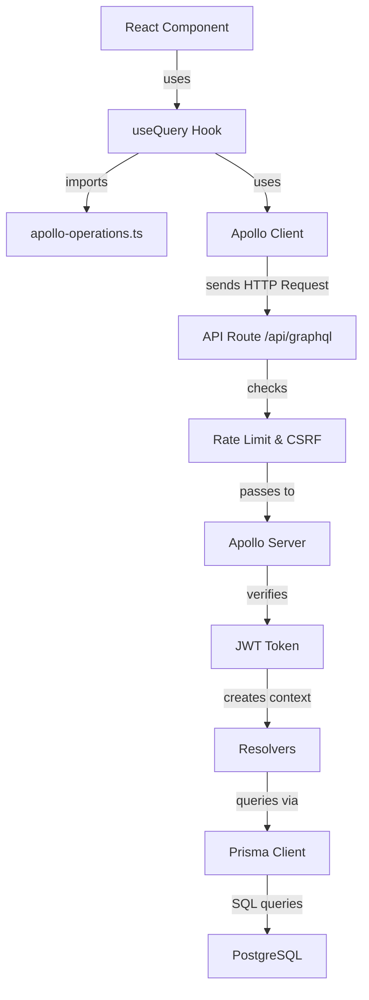

# GraphQLアーキテクチャ完全ガイド - Setlist Studio

この文書では、Setlist StudioのGraphQLアーキテクチャを実際のコードと具体的な処理フローで解説します。

## 📚 関連ドキュメント

- **[GraphQL初心者ガイド](./GraphQL-Beginner-Guide.md)** - GraphQL入門とレストラン比喩
- **[GraphQLライブラリガイド](./GraphQL-Libraries-Guide.md)** - 使用ライブラリの詳細解説
- **[PrismaとGraphQLの統合ガイド](../../database/Prisma-GraphQL-Integration-Guide.md)** - 具体的な実装方法とベストプラクティス

**💡 このガイドの位置づけ**: GraphQLアーキテクチャの全体像を把握し、具体的な実装は統合ガイドで学習してください。

## 🏢 全体アーキテクチャ

```
React Component → Apollo Client → API Route → Apollo Server → Resolver → Prisma → PostgreSQL
(フロントエンド)    (HTTPクライアント)   (セキュリティ)    (GraphQL処理)   (ビジネスロジック)  (ORM)   (データベース)
```

このアプリケーションは**統一Next.jsアーキテクチャ**を採用し、Vercel Functions互換の設計になっています。

---

## 🔄 実際のセットリスト取得フロー（完全版）

### 1. クエリ定義（gqlタグ）

```typescript
// src/lib/server/graphql/apollo-operations.ts

import { gql } from '@apollo/client';

// GraphQLクエリをgqlタグで定義
export const GET_SETLISTS = gql`
  query GetSetlists {
    setlists {
      id
      title
      artistName
      eventName
      eventDate
      isPublic
      theme
      items {
        id
        title
        note
        order
      }
      createdAt
      updatedAt
    }
  }
`;
```

**ポイント**:
- `gql`タグがGraphQLクエリをApollo Clientが解析可能な形式に変換
- フラグメント（例：`${SETLIST_FIELDS}`）を使ってクエリの一部を再利用可能
- graphql-codegenを使ってTypeScriptの型を自動生成可能

### 2. フロントエンドでクエリ実行

```typescript
// src/app/HomeClient.tsx

import { useQuery } from '@apollo/client';
import { GET_SETLISTS } from '@/lib/server/graphql/apollo-operations';

export default function HomeClient() {
  const { isLoggedIn } = useAuth();
  
  // Apollo ClientのuseQueryフックでデータ取得
  const { data: setlistsData, loading: setlistsLoading } = useQuery<GetSetlistsResponse>(
    GET_SETLISTS,
    {
      skip: !isLoggedIn,            // ログインしていない場合はスキップ
      fetchPolicy: 'cache-and-network', // キャッシュとネットワーク両方を使用
      errorPolicy: 'all',           // エラーでも部分的なデータを返す
    },
  );

  // 取得したデータをコンポーネントに渡す
  return (
    <SetlistDashboard 
      setlistsData={setlistsData} 
      setlistsLoading={setlistsLoading} 
    />
  );
}
```

**ポイント**:
- `useQuery`フックが自動的にHTTPリクエストを送信
- `skip`オプションで条件付き実行が可能
- ローディング状態とエラー処理を自動管理

### 3. Apollo Clientの設定と送信

```typescript
// src/lib/client/apollo-client.ts

import { ApolloClient, InMemoryCache, createHttpLink } from '@apollo/client';
import { setContext } from '@apollo/client/link/context';

// HTTPリンクの設定（エンドポイント指定）
const httpLink = createHttpLink({
  uri: '/api/graphql',        // Next.js API Routeのエンドポイント
  credentials: 'include',     // HttpOnly Cookieを含める
});

// 認証とCSRF保護のためのリンク
const authLink = setContext(async (_, { headers }) => {
  // CSRFトークンを取得
  const csrfToken = await getCSRFToken();

  return {
    headers: {
      ...headers,
      'x-csrf-token': csrfToken || '',  // CSRFトークンをヘッダーに追加
    },
  };
});

// Apollo Clientインスタンスの作成
export const apolloClient = new ApolloClient({
  link: authLink.concat(httpLink),
  cache: new InMemoryCache(),           // クエリ結果をキャッシュ
  defaultOptions: {
    watchQuery: {
      fetchPolicy: 'cache-first',       // デフォルトでキャッシュ優先
    },
  },
});
```

### 実際のHTTPリクエスト

Apollo Clientが以下のようなHTTPリクエストを送信します：

```http
POST /api/graphql HTTP/1.1
Host: localhost:3000
Content-Type: application/json
x-csrf-token: abc123...
Cookie: auth=eyJhbGciOiJIUzI1NiIs...

{
  "query": "query GetSetlists { setlists { id title artistName eventName eventDate isPublic theme items { id title note order } createdAt updatedAt } }",
  "variables": {}
}
```

### 4. API Route でのセキュリティチェック

```typescript
// src/app/api/graphql/route.ts

export async function POST(request: NextRequest) {
  // 並列処理で高速化
  const bodyPromise = request.clone().text();
  const apiRateLimitPromise = createApiRateLimit(prisma)(request);
  const serverPromise = getServerInstance();

  const [body, apiRateLimitResponse, server] = await Promise.all([
    bodyPromise,
    apiRateLimitPromise,
    serverPromise,
  ]);

  // 1. API レート制限チェック（1分間に300回まで）
  if (apiRateLimitResponse) {
    if (apiRateLimitResponse.status === 429) {
      return Response.json(
        {
          error: getErrorMessage(request, 'rateLimitExceeded'),
        },
        { status: 429 }
      );
    }
  }

  // 2. 認証リクエストの場合は追加のレート制限
  const isAuthRequest = /(?:login|register)/.test(body);
  if (isAuthRequest) {
    const authRateLimit = await createAuthRateLimit(prisma)(request);
    if (authRateLimit) return authRateLimit;
  }

  // 3. CSRF保護チェック
  const csrfResult = await csrfProtection(request, prisma);
  if (csrfResult) {
    return Response.json(
      { error: 'CSRF validation failed' },
      { status: 403 }
    );
  }

  // 4. Apollo Server に処理を委譲
  const handler = startServerAndCreateNextHandler(server, {
    context: async (req) => createSecureContext(req),
  });
  
  return handler(request);
}
```

### 5. Apollo Server での処理

```typescript
// src/app/api/graphql/route.ts（続き）

// GraphQLスキーマのビルド
function getSchema(): GraphQLSchema {
  return getPreBuiltSchema();  // 事前ビルド済みスキーマを使用
}

// Apollo Server インスタンスの作成
async function createServer() {
  const graphqlSchema = getSchema();

  return new ApolloServer({
    schema: graphqlSchema,
    introspection: process.env.NODE_ENV !== 'production',
    validationRules: [
      depthLimit(10),  // クエリの深さを10階層に制限
    ],
    formatError: (err) => {
      console.error('GraphQL Error:', err);

      if (process.env.NODE_ENV === 'production') {
        // 本番環境では詳細なエラー情報を隠蔽
        const userFriendlyErrors = [
          '認証', '権限', 'メールアドレス', 'パスワード',
          'authentication', 'unauthorized', 'invalid',
        ];

        const isUserError = userFriendlyErrors.some((keyword) =>
          err.message.toLowerCase().includes(keyword.toLowerCase()),
        );

        if (isUserError) {
          return { message: err.message };
        }

        return { message: 'サーバーエラーが発生しました。' };
      }

      return err;
    },
  });
}

// セキュアなコンテキスト作成（JWT認証）
async function createSecureContext(req: NextRequest) {
  await ensureConnection();  // DB接続確認

  const cookies: { [key: string]: string } = {};
  req.cookies.getAll().forEach((cookie) => {
    cookies[cookie.name] = cookie.value;
  });

  // JWTトークンからユーザー情報を取得
  const token = cookies.auth;
  let userId = null;
  let email = null;
  let username = null;

  if (token) {
    try {
      const decoded = jwt.verify(token, process.env.JWT_SECRET!) as JWTPayload;
      userId = decoded.userId;
      email = decoded.email;
      username = decoded.username;
    } catch (error) {
      console.error('JWT verification failed:', error);
    }
  }

  return withI18n(req, {
    userId,
    email,
    username,
    prisma,
    cookies,
    ipAddress: req.headers.get('x-forwarded-for') || 'unknown',
  });
}
```

### 6. Resolver でのビジネスロジック実行

```typescript
// src/lib/server/graphql/resolvers/SetlistResolver.ts

import { Resolver, Query, Mutation, Arg, Ctx, UseMiddleware, ID } from 'type-graphql';
import { Context } from '../context';
import { Setlist } from '../types/Setlist';
import { AuthMiddleware } from '../../auth/middleware';

@Resolver(() => Setlist)
export class SetlistResolver {
  /**
   * ユーザーのセットリスト一覧を取得
   */
  @Query(() => [Setlist])
  @UseMiddleware(AuthMiddleware)  // 認証必須
  async setlists(@Ctx() ctx: Context): Promise<Setlist[]> {
    // 最適化されたクエリを使用
    return ctx.prisma.setlist.findMany({
      where: { userId: ctx.userId },
      include: {
        items: {
          orderBy: { order: 'asc' },
          select: {
            id: true,
            title: true,
            note: true,
            order: true,
            setlistId: true,
          },
        },
      },
      orderBy: { createdAt: 'desc' },
    }) as Promise<Setlist[]>;
  }

  /**
   * 特定のセットリストを取得（公開設定と認証に基づくアクセス制御付き）
   */
  @Query(() => Setlist, { nullable: true })
  async setlist(
    @Arg('id', () => ID) id: string,
    @Ctx() ctx: Context
  ): Promise<Setlist | null> {
    const setlist = await ctx.prisma.setlist.findUnique({
      where: { id },
      include: {
        items: {
          orderBy: { order: 'asc' },
        },
      },
    });

    if (!setlist) {
      return null;
    }

    // 公開セットリストは誰でもアクセス可能
    if (setlist.isPublic) {
      return setlist as Setlist;
    }

    // 非公開セットリストは所有者のみアクセス可能
    if (!ctx.userId || setlist.userId !== ctx.userId) {
      throw new Error('このセットリストへのアクセス権限がありません');
    }

    return setlist as Setlist;
  }
}
```

### 7. データベースアクセス（Prisma）

Prismaが以下のようなSQLを生成・実行します：

```sql
-- セットリスト一覧を取得
SELECT 
  s.id, s.title, s."artistName", s."eventName", 
  s."eventDate", s."isPublic", s.theme, 
  s."createdAt", s."updatedAt", s."userId"
FROM "Setlist" s
WHERE s."userId" = $1
ORDER BY s."createdAt" DESC;

-- 関連するセットリストアイテムを取得
SELECT 
  si.id, si.title, si.note, si."order", si."setlistId"
FROM "SetlistItem" si
WHERE si."setlistId" IN ($1, $2, ...)
ORDER BY si."order" ASC;
```

### 8. レスポンスの返却

```json
{
  "data": {
    "setlists": [
      {
        "id": "clxxxxx123",
        "title": "2024年夏フェスセット",
        "artistName": "mosquitone",
        "eventName": "Summer Music Festival",
        "eventDate": "2024-08-15T00:00:00.000Z",
        "isPublic": false,
        "theme": "BasicBlack",
        "items": [
          {
            "id": "item1",
            "title": "Opening Song",
            "note": "アコースティックver",
            "order": 1
          },
          {
            "id": "item2",
            "title": "Hit Song",
            "note": "",
            "order": 2
          }
        ],
        "createdAt": "2024-07-01T10:00:00.000Z",
        "updatedAt": "2024-07-01T10:00:00.000Z"
      }
    ]
  }
}
```

### 9. フロントエンドでの表示

```typescript
// src/components/home/SetlistDashboard.tsx

interface SetlistDashboardProps {
  setlistsData: GetSetlistsResponse | undefined;
  setlistsLoading: boolean;
}

export function SetlistDashboard({ setlistsData, setlistsLoading }: SetlistDashboardProps) {
  if (setlistsLoading) {
    return <LoadingSpinner />;
  }

  const setlists = setlistsData?.setlists || [];

  return (
    <Box>
      <Typography variant="h5">マイセットリスト</Typography>
      <Grid container spacing={2}>
        {setlists.map((setlist) => (
          <Grid item xs={12} sm={6} md={4} key={setlist.id}>
            <Card>
              <CardContent>
                <Typography variant="h6">{setlist.title}</Typography>
                <Typography color="text.secondary">
                  {setlist.artistName}
                </Typography>
                <Typography variant="body2">
                  {setlist.items.length}曲
                </Typography>
              </CardContent>
            </Card>
          </Grid>
        ))}
      </Grid>
    </Box>
  );
}
```

---

## 🔗 完全なデータフロー図

```
【セットリスト取得の詳細フロー】

1. gqlタグでクエリ定義
   ↓
   gql`
     query GetSetlists {     ← クエリ名
       setlists {            ← 取得したいフィールド
         id
         title
         artistName
         items { ... }
       }
     }
   `
   ↓
2. Reactコンポーネントで実行
   ↓
   useQuery(GET_SETLISTS)    ← gqlで定義したクエリを使用
   ↓
3. Apollo ClientがHTTPリクエスト送信
   ↓
   POST /api/graphql
   Headers: {
     "x-csrf-token": "xxx...",  // CSRF保護
     Cookie: "auth=xxx..."      // JWTトークン
   }
   Body: {
     "query": "query GetSetlists { setlists { ... } }"
   }
   ↓
4. Next.js API Routeで受信
   ↓
   - APIレート制限チェック（1分間に300回まで）
   - 認証リクエストの追加レート制限
   - CSRF保護チェック
   ↓
5. Apollo ServerでGraphQL処理
   ↓
   - JWTトークン検証
   - コンテキスト作成（userId, email等）
   - クエリ深度制限（10階層まで）
   ↓
6. SetlistResolverでデータ取得
   ↓
   - AuthMiddlewareで認証チェック
   - Prismaでデータベースアクセス
   - ユーザーIDでフィルタリング
   ↓
7. PostgreSQLからデータ取得
   ↓
   SELECT * FROM "Setlist" 
   WHERE "userId" = '...' 
   ORDER BY "createdAt" DESC;
   ↓
8. GraphQLレスポンス返却
   ↓
   {
     "data": {
       "setlists": [
         { "id": "1", "title": "...", ... }
       ]
     }
   }
   ↓
9. Apollo Clientでキャッシュ・表示
   ↓
   - InMemoryCacheに保存
   - Reactコンポーネントが再レンダリング
```

---

## 📋 各ファイルの役割と依存関係

### ファイル構成

```
フロントエンド
├── src/lib/server/graphql/apollo-operations.ts  # GraphQLクエリ定義
├── src/lib/client/apollo-client.ts              # Apollo Client設定
├── src/components/providers/ApolloProvider.tsx  # React Provider
└── src/app/HomeClient.tsx                       # クエリ実行

バックエンド
├── src/app/api/graphql/route.ts                 # API Route（エントリポイント）
├── src/lib/server/graphql/generated-schema.ts   # 生成されたGraphQLスキーマ
├── src/lib/server/graphql/resolvers/
│   ├── SetlistResolver.ts                       # セットリスト操作
│   ├── SongResolver.ts                          # 楽曲操作
│   ├── AuthResolver.ts                          # 認証操作
│   └── UserResolver.ts                          # ユーザー操作
└── src/lib/server/prisma.ts                     # DBクライアント
```

### 依存関係



---

## 🎯 まとめ

### 各レイヤーの役割

| レイヤー | ファイル | 役割 |
|---------|----------|------|
| **gql定義** | `apollo-operations.ts` | GraphQLクエリ/ミューテーションの定義 |
| **フロントエンド** | React Components | Apollo Clientでデータ取得・表示 |
| **HTTPクライアント** | `apollo-client.ts` | クエリをサーバーに送信、CSRF保護 |
| **API Route** | `/api/graphql/route.ts` | セキュリティチェック（レート制限、CSRF） |
| **Apollo Server** | 同上 | GraphQLスキーマ処理、コンテキスト作成 |
| **Resolver** | `SetlistResolver.ts` | ビジネスロジック、データ取得 |
| **ORM** | Prisma | データベースクエリ実行 |
| **データベース** | PostgreSQL | データ永続化 |

### 重要なポイント

1. **gqlタグ**: GraphQLクエリをJavaScriptで使える形に変換
2. **Apollo Client**: クエリ実行、キャッシュ管理、状態管理を担当
3. **API Route**: Next.jsの機能でセキュリティを担保
4. **Apollo Server**: GraphQLクエリを解析して適切なResolverを実行
5. **Resolver**: 実際のデータ操作を行うビジネスロジック層

このアーキテクチャにより、セキュアでスケーラブルなGraphQL APIを実現しています。


---

## 🔧 技術的な詳細

### セキュリティ機能

| セキュリティ機能 | 実装場所 | 目的 |
|--------------|----------|------|
| **HttpOnly Cookie** | `apollo-client.ts` | XSS攻撃からJWTトークンを保護 |
| **CSRF Protection** | API Route | クロスサイトリクエストフォージェリ防止 |
| **Rate Limiting** | API Route | DDoS攻撃・ブルートフォース攻撃防止 |
| **Query Depth Limit** | Apollo Server | GraphQL DoS攻撃防止（10階層まで） |
| **JWT Validation** | Context Creation | ユーザー認証・認可 |
| **AuthMiddleware** | Resolver | エンドポイントごとのアクセス制御 |

### パフォーマンス最適化

1. **並列処理**: API Routeで`Promise.all`を使用してレート制限、CSRFチェック、サーバー初期化を同時実行
2. **キャッシュ戦略**: Apollo Clientの`InMemoryCache`でクエリ結果をメモリにキャッシュ
3. **クエリ最適化**: Prismaの`include`を使用してN+1問題を回避
4. **接続プール**: Prisma Clientをグローバルインスタンスとして管理し、DB接続を再利用

---

## 🔍 トラブルシューティング

### よくあるエラーと対処法

| エラー | 原因 | 対処法 |
|-------|------|----------|
| **CSRF token missing** | CSRFトークンが送信されていない | Apollo Clientの設定を確認 |
| **Rate limit exceeded** | APIコールが多すぎる | リクエスト頻度を減らす |
| **Authentication failed** | JWTトークンが無効/期限切れ | 再ログイン |
| **Query depth exceeded** | クエリが深すぎる | クエリをシンプルに |
| **N+1 problem** | リレーションの非効率な取得 | Prismaの`include`使用 |

### デバッグ方法

1. **ブラウザのネットワークタブでリクエスト確認**
   - Headersに`x-csrf-token`が含まれているか
   - Cookieに`auth`（JWTトークン）が含まれているか
   - Responseのステータスコードとエラーメッセージ

2. **Apollo Client DevToolsを使用**
   - Chrome/Firefox拡張機能をインストール
   - クエリの実行状況と結果を確認
   - キャッシュの状態を確認

3. **サーバーログを確認**
   - GraphQLエラー： `console.error('GraphQL Error:', err)`
   - Prismaクエリログ： 開発環境では`log: ['query', 'error']`が有効
   - JWT検証エラー： `console.error('JWT verification failed:', error)`

---

## 📖 GraphQL用語解説

### 重要な概念

#### gqlタグ
```typescript
const GET_SETLISTS = gql`...`
```
GraphQLクエリをJavaScript/TypeScriptで使える形に変換するテンプレートタグ。

#### Query（クエリ）
データを取得するためのGraphQL操作。REST APIのGETに相当。

#### Mutation（ミューテーション）
データを作成・更新・削除するためのGraphQL操作。REST APIのPOST/PUT/DELETEに相当。

#### Resolver（リゾルバー）
GraphQLスキーマの各フィールドに対して「実際にデータをどう取得・操作するか」を定義する関数。

#### Apollo Client
フロントエンドからGraphQL APIを呼び出すためのクライアントライブラリ。

#### Apollo Server
GraphQL APIを提供するためのサーバーライブラリ。

---

## 🏗️ GraphQLアプリケーション設計フロー

### 実装の流れ

1. **Prismaスキーマ定義** (`prisma/schema.prisma`) → データベース設計
2. **GraphQL Type定義** (Type-GraphQLデコレーター) → APIスキーマ設計
3. **Resolver実装** (`@Query`, `@Mutation`デコレーター) → ビジネスロジック
4. **gqlクエリ定義** (`apollo-operations.ts`) → フロントエンド用クエリ
5. **Reactコンポーネント実装** (`useQuery`, `useMutation`) → UI統合

詳細な実装方法については、以下のガイドを参照：
- [GraphQL初心者ガイド](./GraphQL-Beginner-Guide.md)
- [GraphQLライブラリガイド](./GraphQL-Libraries-Guide.md)
- [PrismaとGraphQLの統合ガイド](../../database/Prisma-GraphQL-Integration-Guide.md)